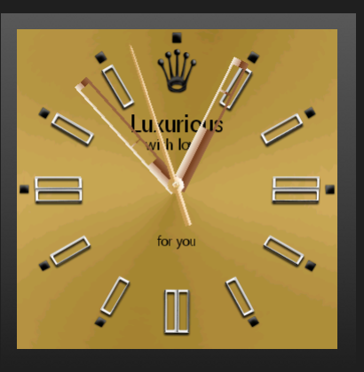

# LuxuriousWatchFace

Kotlin watchface code sample

## Why?

I made this sample for learn, for improve my code and I'll be glad to see if it helps somebody. I appreciate every bug you find or just a code tip.

## Contacts
Send me your suggestions to maxkikin@yandex.ru

